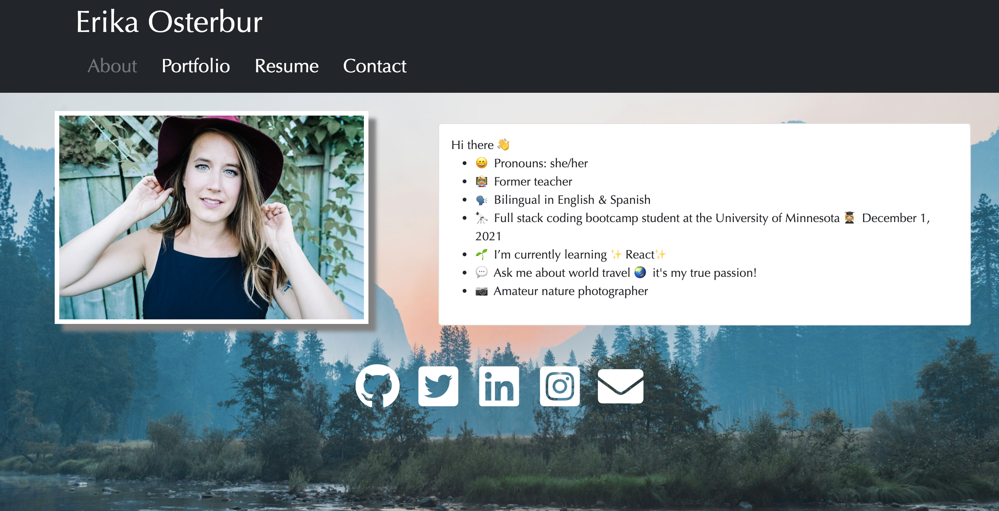

# Professional Portfolio

## User Story
This professional portfolio built with React.js showcases my work as a web developer. My portfolio includes sections that tell a user about myself and how to get in contact with me. A user is also able to view and download my resume.

## Screenshot

## Link to GitHub Repo
[Link to the Github Repo](https://github.com/erikaosterbur/react-portfolio.git)

## Link to deployed page
[Link to the Deployed Page](https://erikaosterbur.github.io/react-portfolio/)